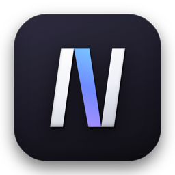

<p align="center">
  
</p>

<h1 align="center">NoteCast Editor</h1>

<p align="center">
  A floating markdown notepad for macOS. With a shortcut — from anywhere.
</p>

<p align="center">
  <a href="https://github.com/AlexWasHeree/notecast-editor-app/releases/latest/download/NoteCast-Editor.dmg"><b>Download for macOS</b></a>
  ·
  <code>brew install --cask alexwasheree/tap/notecast-editor</code>
</p>

<!-- Demo video: edit this file on github.com and drag notecast-demo.mov here — GitHub turns it into an inline player. -->

---

Press **⌘⇧Space** in any app and a notepad floats on top of it. Write, press Escape, and you're back where you were — no window switching, no Dock icon, nothing to manage.

I built it because I kept losing thoughts in the time it took to open a notes app and find the right place for them. I use it every day, and it's free.

## What it does

- **Opens over anything** with a global shortcut, without taking focus away from the app you're in
- **Live markdown** — headings, lists, tasks, quotes, code and links render as you type
- **Capture first, organize later** — every new note lands in an inbox and autosaves; file it into a theme when you're ready
- **Themes inside themes**, navigable and searchable entirely from the keyboard
- **Raw mode** for plain-text notes that shouldn't be parsed as markdown
- **Import a folder** of `.md` / `.txt` files (an Obsidian vault, for example) — subfolders become themes
- **Export** a note, a theme, or everything back to markdown files
- **Local only** — your notes live in a SQLite file on your Mac. No account, no cloud, no tracking

## Install

**Homebrew**

```sh
brew install --cask alexwasheree/tap/notecast-editor
```

**Or download** the [latest DMG](https://github.com/AlexWasHeree/notecast-editor-app/releases/latest/download/NoteCast-Editor.dmg) and drag NoteCast Editor into Applications.

### First launch

NoteCast Editor isn't notarized by Apple yet, so macOS blocks it the first time:

1. Open NoteCast Editor — macOS will say it can't verify the developer. Click **Done**.
2. Go to **System Settings → Privacy & Security**, scroll down, and click **Open Anyway** next to NoteCast Editor.
3. Confirm. You only need to do this once.

Then press **⌘⇧Space**.

**Requirements:** macOS 13 Ventura or later, Apple silicon (M1 or newer).

## Shortcuts

| | |
|---|---|
| ⌘⇧Space | Show / hide the notepad from anywhere |
| ⌘N | New note |
| ⌘S | Move the note from the inbox into your library |
| ⌘B | Toggle the sidebar |
| ⌥Tab | Switch between the editor and your library |
| ⌘⌥R | Toggle raw (plain-text) mode |
| ⌘⌥ ← / → / ↑ / ↓ | Snap or resize the window |

Every global shortcut can be changed in Settings (⌘,).

## Early access

This is early. Expect rough edges — and frequent updates. If something breaks, feels off, or is missing, use the **feedback button** (the speech bubble at the top of the notepad). It comes straight to me, and it's what decides what gets built next.

Updates: `brew upgrade --cask notecast-editor`, or grab the new DMG from [Releases](https://github.com/AlexWasHeree/notecast-editor-app/releases).

---

NoteCast Editor is free to use. The source code is not public.
